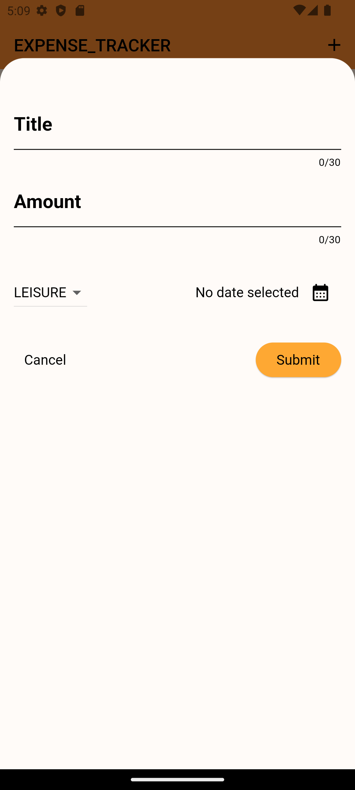

# Flutter Expense Tracker App

This Flutter app allows users to track their expenses across four categories: Food, Work, Leisure, and Travel. The app features both dark and light themes for a personalized experience. Additionally, it includes a bar chart to visualize expenses for specific categories. All expense data is stored on Firebase Realtime Database, and users can also delete expenses.

## Table of Contents 

- [Demo](#demo)
- [Screenshots](#screenshots)
- [Features](#features)
- [Installation](#installation)
- [Firebase Configuration](#firebase-configuration)
- [Usage](#usage)
- [Deleting Expenses](#deleting-expenses)
- [Contributing](#contributing)


## Demo

<div align="center">

</div>

## Screenshots


<div align="center">
  <table>
    <tr>
      <th>Light Theme</th>
      <th>Dark Theme</th>
    </tr>
    <tr>
      <td></td>
      <td></td>
    </tr>
    <tr>
      <td></td>
      <td></td>
    </tr>
    <tr>
      <td></td>
      <td></td>
    </tr>
    <tr>
      <td></td>
      <td></td>
    </tr>
    <tr>
      <td></td>
      <td></td>
    </tr>
  </table>
</div>


## Features

- Track expenses in four categories: Food, Work, Leisure, and Travel.
- Dark and light themes for personalized experience.
- Bar chart to visualize expenses.
- Firebase Realtime Database integration for data storage.
- Ability to delete expenses.

## Installation

1. Clone the repository using:

```bash
git clone https://github.com/PrathameshPatil-01/EXPENSE_TRACKER-FLUTTER.git
```

2. Navigate to the project directory:

```bash
cd EXPENSE_TRACKER-FLUTTER
```

3. Install dependencies:

```bash
flutter pub get
```

4. Run the app:

```bash
flutter run
```

## Firebase Configuration

1. Create a new Firebase project in the [Firebase Console](https://console.firebase.google.com/).
2. Add an Android app to your Firebase project and follow the setup instructions.
3. Download the `google-services.json` file and place it in the `android/app` directory.

## Usage

1. Open the app on your device/emulator.
2. Start adding expenses in different categories.

## Deleting Expenses

To delete an expense, swipe left or right on the expense card and confirm the deletion.

## Contributing

Feel free to open issues or pull requests for any improvements or bug fixes.

---
